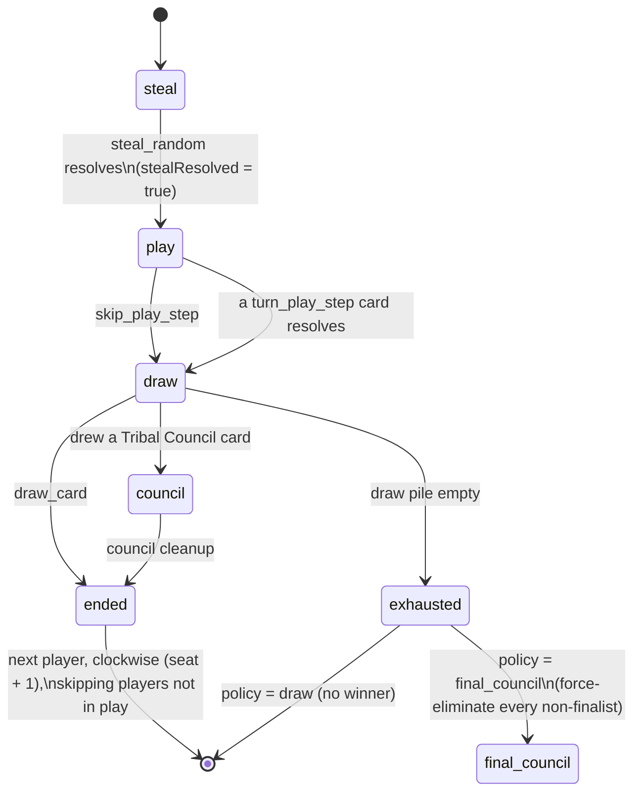
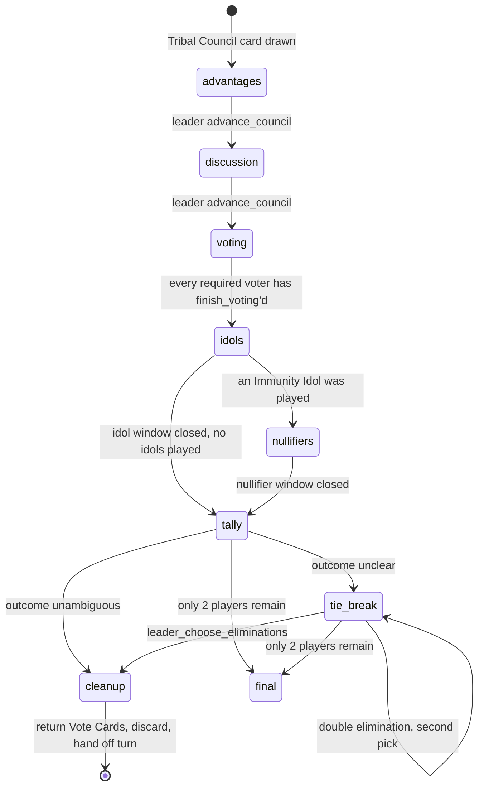
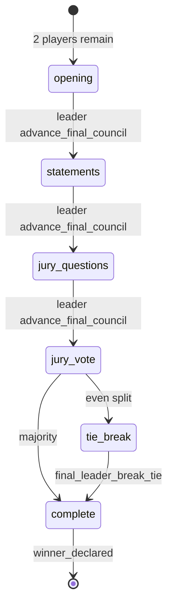

# Architecture

How the rewrite is put together, and why each boundary exists.

The short version: **a pure, deterministic rules engine that knows nothing about Discord, wrapped
by a Discord layer that knows nothing about the rules.** Everything else in this document follows
from that one split. `docs/RULES.md` is the specification; `docs/AUDIT.md` is the list of 129
defects the old code shipped with, most of which were possible only because that split did not
exist.

---

## 1. Module boundaries and the dependency rule

```
src/
  config.ts            every tunable in the codebase. Reads process.env exactly once.
  engine/              PURE. Deterministic. No I/O, no clock, no discord.js.
    types.ts           ids, enums, domain types, Action union, the Game facade
    events.ts          the GameEvent union — what happened, never how to say it
    cards.ts           the card catalog + deck composition tables (data only)
    rng.ts             seedable PRNG; the only stateful thing in the engine
    card.ts  player.ts  deck.ts  game.ts  tribal.ts  final.ts  challenges.ts   (later phase)
  discord/             the ONLY place discord.js appears
    registry.ts        GameId -> Game, keyed per channel
    renderers/         GameEvent -> message / embed / component
    ui/                buttons, selects, modals, custom_id encoding
  commands/            slash command definitions; translate interactions into Actions
  events/              discord.js gateway event handlers
  persistence/         snapshot read/write; the only place node:fs appears
  tests/               vitest; drives the engine directly, no Discord anywhere
```

### The dependency rule

```
commands/ ─┐
events/   ─┼──▶ discord/ ──▶ engine/ ──▶ config.ts
persistence/─┘                   │
                                 └──▶ (nothing else)
```

**`src/engine/**` must never import `discord.js`, `node:fs`, `node:path`, or any other
platform API.** It may import `src/config.ts` for _types_ and defaults, but never its live
`config` / `engineConfig` bindings — those read `process.env`. Arrows never point left.

This is **enforced, not documented**, in two places:

```sh
# scripts/check-engine-purity.sh, run by `npm run engine:purity` and by CI
grep -rnE "Math\.random|Date\.now|setTimeout|setInterval|from ['\"](discord\.js|node:)" src/engine/
```

and by an eslint override on `src/engine/**` (`no-restricted-imports` for `discord.js` /
`node:*` / the live config bindings, `no-restricted-globals` for `process`, `setTimeout`,
`setInterval`, and `no-restricted-properties` for `Date.now` / `Math.random`). Before this,
the rule held only because every engine import of `../config.js` happened to be an
`import type`; one `import { engineConfig }` would have bound the engine to `process.env`
with zero test failures.

Two consequences worth stating explicitly:

- **The engine has no clock.** It never calls `setTimeout`, `Date.now()`, or `setInterval`.
  Every entry point takes `nowMs` as a parameter. Deadlines are absolute timestamps stored in
  state and expired by `Game.tick(nowMs)`. A test fast-forwards an hour by passing a bigger
  number. It has no `Math.random()` either: `CreateGameParams.seed` is **required**, and the
  one nondeterministic function in the codebase is `randomSeed()` in `src/discord/seed.ts`.
- **The engine has no identity.** There is no module-level singleton. Games live in the
  `discord/registry`, keyed by channel id, so two servers cannot see each other's state
  (audit #48: the old bot could host exactly one game per process, and a second server
  silently corrupted the first).

### Sessions, hosts and starting over

The registry maps `GameId` (a channel id) → `Game`. Its lifecycle rules:

- **Creating.** `createGame({ gameId, hostId, config, nowMs, seed })`. `hostId` is whoever ran
  the create command; `seed` comes from `randomSeed()` unless `config.deck.rngSeed` pins it.
- **Host-gated actions.** `abandon_game`, `remove_player` and `transfer_host` are refused with
  `not_host` for anyone but `hostId`. There is exactly one authorization field: an always-empty
  `coHostIds` beside it was checked by `requireHost` and populated by nothing, which is audit
  #24's shape rather than its fix. Audit #24 asked for the escape hatch _and_ for the guard:
  "any player must not be able to boot a rival." The Discord layer may additionally admit a
  guild moderator on `abandon_game` alone, and when it does it passes the moderator's id as the
  actor and sets `AbandonGameAction.viaModerator` — the engine's check is on the id it is
  given, and `stage.abandonedById` and the public `game_abandoned` both name the moderator
  rather than the host. Re-dispatching as the host would be a lie in the event log.
- **The host is always at the table.** `leave_game` and `remove_player` pass the role to the
  next seat (`host_changed`, public) when the host is the one going, and `transfer_host` hands
  it over on purpose. A lobby whose LAST player leaves is disposed of — stage `abandoned` with
  `game_abandoned.emptyLobby` — because a lobby with no host and no players can be neither
  begun nor joined, and leaving the session alive would pin the channel against
  `/survivor start`.
- **Starting over** (audit #78). `abandon_game` moves the stage to `abandoned` and the
  registry **drops the entry**; the next `/start` in that channel constructs a brand-new
  `Game` under the same `GameId`. A finished game behaves the same way. There is no in-place
  reset, so no partially-cleared state can survive into the next game.
- **Leaving.** `leave_game` and `remove_player` set `Player.leftAtSeq` and never splice
  `players` — see §4.

### Config

`src/config.ts` is the only file allowed to contain a duration or a limit. Numbers that describe
a _rule_ (7 Sorry For You cards; 4 Tribal Council cards at 3 players) are catalog data in
`engine/cards.ts` instead. Numbers that describe a _policy_ (how long we wait for a reaction) are
config. Nothing else in the codebase gets a bare numeric literal (audit #95: every duration was a
hardcoded literal across seven files, and the UI text already contradicted the code).

`EngineConfig` — limits, deck options, timings, house rules — is a strict subset of
`SurvivorConfig` that omits `discord` and `autosave`, so the engine cannot even name them. It is
**copied into `GameState` at `start_game`**, so a config change mid-session cannot retroactively
alter a game in progress, and a snapshot replays under exactly the rules it was created with.

### House rules

`config.engine.houseRules` holds an answer for every question `docs/RULES.md` lists as genuinely
unresolved by the printed rules — whether Sorry For You blocks Knowledge is Power, whether a Camp
Raid steals a drawn Tribal Council card, what happens when the draw pile empties with three
players alive, and so on. Whenever one of these actually decides an outcome the engine emits a
`house_rule_applied` event, so the bot shows its work rather than quietly inventing rules.

---

## 2. The turn state machine

Rulebook: _"There are 3 parts to your turn"_ and _"Remember: Steal, Play (or don't), then Draw!"_
Audit #9: the old code enforced none of it.



Rules encoded in the shape of the machine:

| Rule                                                 | Mechanism                                                                                                                      |
| ---------------------------------------------------- | ------------------------------------------------------------------------------------------------------------------------------ |
| Steal is **mandatory**                               | `play` is unreachable until `stealResolved` is true                                                                            |
| At most **one** card per turn                        | `cardPlayedThisTurn: CardUid \| null` — set once, checked in validation                                                        |
| Draw is **mandatory and terminal**                   | `draw_card` is the only edge out of `draw`, and it **cannot fail** — there is no `draw_pile_empty` error code (audit #20)      |
| A council fires at the **end** of the turn           | Only the `draw` step can transition to `council`                                                                               |
| Turn order **skips departed and eliminated players** | Successor is computed over `players.filter(isInPlay)` — `eliminatedAtSeq === null && leftAtSeq === null` (audit #10, #23, #24) |
| Reactions do not consume your play                   | Sorry For You, Inheritance, idols and Tribal Advantages set `consumedTurnPlay: false` and never touch `cardPlayedThisTurn`     |

### Draw pile exhaustion

Setup step 5 guarantees the bottom card is a Tribal Council card, so the last draw always
fires a council — but nothing in the rulebook covers a council that _ends_ with 3+ players
alive and an empty pile. `houseRules.drawPileExhaustionPolicy` decides, and both branches are
specified end to end (audit #20/#21):

- **`final_council`** (default). The two players holding the most Survivor Character Cards
  become the finalists; ties broken by fewest cards flipped, then by the game RNG, emitting
  `house_rule_applied`. **Every other player is FULLY eliminated**, in reverse turn order from
  the current player, so each one gets a real `eliminatedAtSeq` and enters the Jury through the
  ordinary `player_eliminated` path — which is what keeps `FinalCouncilState.jury` non-empty
  and its Leader (`max(eliminatedAtSeq)`) derivable. Trigger label: `draw_pile_empty`.
- **`draw`**. `game_finished` with `winnerId: null`. No `winner_declared`.

(`sudden_death` was removed. It was specified as "keep drawing councils" from a pile that is by
definition empty, and only one of the three options was ever specified end to end.)

`turnSafetyTimeout` is a backstop only. A turn normally ends because the player drew, not because
a clock fired.

---

## 3. The Tribal Council state machine

Triggered the instant a player **draws** a Tribal Council card. The drawer becomes Leader.



Phase-by-phase:

- **advantages / discussion** — two states, one window. Control the Vote, Goodwill Gamble and
  I'm the Leader Now are all legal in both and illegal everywhere after (_"You can play as many
  Tribal Advantage Cards as you would like during this discussion, but NOT once voting has
  started!"_). Extra Vote is **not** a Tribal Advantage and is not legal here — audit #69/#40.
  The split into two states exists so the renderer can show the right prompt; the card timing
  `council_before_voting` covers both.
- **voting** — compulsory for everyone holding a Vote Card. The Leader votes first, then the box
  passes left, _"even if they don't have a Vote Card"_. Each vote is one physical card
  (`CastVoteRecord.cardUid`), so an Extra Vote and a stolen Vote Card are distinguishable at
  cleanup. Public events during this phase carry no counts: the table-tapping rhythm exists
  _"so no one can hear how many votes are being cast"_.
- **idols** — opens only after every required vote is in. _"Can only be played at Tribal Council
  AFTER all players have voted, but BEFORE votes are tallied."_ An idol may protect its player or
  anyone else.
- **nullifiers** — entered only if an idol was actually played. Skipped otherwise.
- **tally** — votes for a player with a live (non-nullified) idol are zeroed, not redirected.
- **tie_break** — see below. Re-entered once for a double elimination that needs two decisions.
- **cleanup** — return exactly one Vote Card to every player still holding a Survivor Character
  Card; discard everything used this council including the Tribal Council card; hand the next
  turn to the player on the Leader's **left**, unless I'm the Leader Now overrode it.

Every phase advances on `advance_council` from the Leader, which carries a `from: CouncilPhase`
field. A stale button click from a re-rendered message names the old phase and is rejected with
`stale_phase` — a type-level re-entrancy guard replacing audit #32 ("two invocations inside the
followUp window each decrement lives").

### The tie-break ladder

The single most important rule in the game, and the one the old code got most wrong.

```
                      is it unambiguous who goes home?
                                    │
                   ┌────────────────┴────────────────┐
                  yes                                no
                   │                                  │
              eliminate                    Leader must choose, from the FIRST
                                           non-empty rung of this ladder:

                        1. voted_non_immune            ← non-immune players who got votes
                        2. unvoted_non_immune          ← non-immune players who got none
                        3. played_or_protected_by_idol ← players who PLAYED Immunity Idols
```

The third rung is named for what the rulebook actually says — the players who **played** idols,
which is **not** the same set as the players **protected** by them, because an idol may protect
an ally. If A plays an idol on B, then A is non-immune (and a tier-1 candidate if A got votes)
while B is immune. Calling the rung `immune` would have led an implementer straight to
`VoteTallyRow.immune`, which is the protected set. The default is the printed reading;
`houseRules.tieBreakIdolTierIncludesProtected` widens it to the union for tables that read it
the other way, and says so with `house_rule_applied`. `VoteTallyRow.protectedByIdolUids` gives
both the candidate set and the "your votes don't count" render one source in state.

Encoded once, as `TIE_BREAK_LADDER` in `engine/types.ts`. The engine walks it, stops at the first
rung with enough candidates, and puts **only that rung's players** into
`PendingLeaderDecision.candidates` — so a UI cannot offer an ineligible target even by accident.
Descending a rung emits `tie_break_tier_descended`, because rung 3 reads as a bug to anyone who
has not read the fine print: **an Immunity Idol is not absolute protection.** If every non-immune
candidate is exhausted, an idol player goes home anyway. A council can never end with nobody out.

Double elimination adds four cases on top, all from the rulebook:

| Situation                         | Resolution                                                              |
| --------------------------------- | ----------------------------------------------------------------------- |
| 3+ tied for most                  | Leader picks which **2** go (`choose: 2`)                               |
| exactly 2 tied for most           | both go — **no** Leader decision                                        |
| 1 clear first, 2+ tied for second | first goes immediately, then Leader picks one of the tied               |
| only 3 players left, 2 would go   | Leader eliminates **one**, then Final Tribal Council starts immediately |

And the load-bearing word: _"2 **different** players"_ — one player can never lose both character
cards at a single council, tracked by `CouncilState.flippedThisCouncil`. The field is named for
**flips**, not eliminations: a two-torch player who has been flipped is still in the game but
must still be excluded from the second elimination, and a list populated from
`player_eliminated` would miss exactly that case.

### Voting is compulsory per CARD, not per player

`CouncilState.requiredCasts` is a list of `{ playerId, cardUid, source }`, one entry per card
that MUST be spent this council: your Vote Card, a Vote Card taken with Control the Vote
(_"You MUST use that Vote Card in addition to your Vote Card"_), and a Goodwill Gamble you were
handed (_"MUST be used during the Tribal Council at which it is played"_). `finish_voting` is
refused with `must_cast_mandatory_vote` while a player still has an entry. A `PlayerId[]`
cannot express "this player owes two casts", which is why the error code previously had nothing
to check against.

**And it has an expiry default, like every other window.** "Everyone must vote" is a rule about a
table where the box is physically handed to the next seat; it is not a rule that the game stops
when somebody walks away. When the voting backstop
(`timings.councilVotingSafetyTimeout`) runs out with casts outstanding, the engine FORFEITS them
— `votes_forfeited`, public, naming who did not cast — and closes the box with the votes in it.
The owed cards are left where they are, because cleanup collects every Vote Card back to the
bank and discards any uncast Goodwill Gamble anyway. Re-arming the clock instead, which is what
it used to do, meant one absent player froze a council permanently: `advance_council` and
`finish_voting` both refuse with `must_cast_mandatory_vote`, so there was no non-destructive way
out at all.

The bot uses the rulebook's sanctioned private-voting variant — _"put the Voting Box in another
room and let players vote in private"_ — so there is no vote ORDER and `voting_opened` does not
promise one. Cast votes live in `zones.votingBox`; `council.votes` holds the voter/target
metadata for those same uids and is **private until the `tally` phase** (`VOTES_PUBLIC_FROM`).

---

## 4. The Final Tribal Council state machine

Trigger: **the moment only 2 players remain**, regardless of how many character cards they hold.

**The trigger is ONE predicate, evaluated in ONE place.** `players.filter(isInPlay).length === 2`
inside a single `afterPlayerCountChanged()` helper, called after every character-card flip,
every full elimination, every departure and every draw. Audit #14 is precisely "the trigger
fires on only one of four elimination paths", and its prescribed fix is to centralise the check
rather than enumerate the call sites — so `FinalCouncilStarted.trigger` is a **provenance label
for the narration, never a branch the engine takes**. Six routes reach two players, and all six
have engine tests:

| `trigger`                     | Route                                                                 |
| ----------------------------- | --------------------------------------------------------------------- |
| `single_elimination`          | a Single Elimination council took the table from 3 to 2               |
| `double_elimination_partial`  | a Double Elimination's **first** flip already left 2 — mid-resolution |
| `double_elimination_complete` | a Double Elimination that completed normally, **4 down to 2**         |
| `three_player_override`       | "only 3 left and 2 would go": the Leader flips one, then this         |
| `draw_pile_empty`             | exhaustion policy `final_council` force-eliminated the non-finalists  |
| `player_left_game`            | `leave_game` / `remove_player` took a 3-player game to 2              |

`double_elimination_complete` is the most common route at 4+ players and was the one missing
from the first draft's closed enum — which is exactly the failure mode a closed enum at the top
of a contract produces.

### Leaving the table is not being voted out

`Player` carries **two** distinct exit fields, and every liveness question reads
`isInPlay(p) = eliminatedAtSeq === null && leftAtSeq === null`:

- `eliminatedAtSeq !== null` — voted out, and therefore **on the Jury**.
- `leftAtSeq !== null` — gone from the table entirely (quit or host-removed), and on **no** jury.

`players` is **never spliced**. Splicing would break `seat` ordering, elimination ordering and
every `PlayerId` reference held in `council.votes`, `idolPlays`, `campRaid.raiderId` and open
pendings; setting `eliminatedAtSeq` instead would poison the Jury and the Final Council Leader
derivation. Both were the bugs audit #24 asked to prevent.

A departure runs the same cleanup as an elimination minus the jury and minus Inheritance: hand
to the Discard Pile face up, Vote Cards to `voteCardBank`, granted Goodwill Gambles discarded,
any Camp Raid marker in front of them cancelled, any pending naming them cancelled with
`pending_cancelled` reason `player_eliminated`, and any obligation of theirs dropped from
`council.requiredCasts` so voting can still close.

**Departure down to 2 players with an EMPTY jury** (a 3-player game losing one player before
anyone was ever voted out) does **not** open a Final Tribal Council — there would be no Leader
and nobody to vote. The game ends immediately: `winner_declared` with method `sole_survivor` for
whoever holds more Survivor Character Cards, or, if they are level, `game_finished` with a null
winner and no `winner_declared` at all. This is the invariant that lets
`FinalCouncilState.leaderId` stay non-nullable everywhere else.

The three rulebook routes still read as they always did:

1. a Single Elimination council,
2. a Double Elimination council **after just the first flip** — mid-resolution,
3. running out of the draw pile.



- The **Jury** is every fully-eliminated player.
- The **most recently eliminated player** — `max(eliminatedAtSeq)` — is _both_ a voting Jury
  member _and_ the Final Tribal Council Leader. Deriving it from the elimination sequence means
  every elimination path sets it, unlike audit #18/#35 where one code path assigned it and the
  other three dead-ended the game.
- Finalists **may play no cards** — every card is inert — but may `reveal_hand` as evidence.
- The Jury votes **FOR** a winner, publicly and simultaneously. Votes are held private until
  every juror has voted, then released in one `jury_votes_revealed` event: that is the
  _"3… 2… 1…"_ countdown.
- On a tie the Leader picks, and _"DON'T have to pick the player they originally voted for."_

---

## 5. Event flow: from a click to a message

```
Discord interaction
        │
        ▼
commands/ or discord/ui        decode custom_id → build a typed Action
        │
        ▼
registry.get(channelId)        the Game for THIS channel (never a singleton)
        │
        ▼
game.dispatch(action, Date.now())
        │
        ├── Result.err  ──▶  renderer maps GameError.code → copy → ephemeral reply
        │                     (nothing mutated: validation cannot mutate)
        │
        └── Result.ok   ──▶  { events, state }
                                  │
                                  ├─ persistence: debounced snapshot write
                                  │
                                  ▼
                        for each event: renderers/ pick a template by event.type
                                  │
                        ┌─────────┴──────────┐
                 audience: public      audience: players[...]
                        │                     │
                 channel.send()        ephemeral reply / DM
```

Three properties this buys:

- **The engine never writes prose.** Events carry data only — there is no `message: string`
  anywhere in `events.ts`. A rules test asserts on
  `{ type: 'tie_break_tier_descended', to: 'played_or_protected_by_idol' }`, not on a sentence. Copy changes never
  touch the engine; rule changes never touch the copy.
- **Visibility is a property of the event, not of the call site.** Every event carries an
  `audience` of `public` or `players[...]`, decided once by the rule that governs it: hand
  _contents_ and in-progress votes are private; hand _sizes_, discards, idol plays and every
  elimination are public. Audit #119 (ephemeral and non-ephemeral guards in the same function)
  and #126 (public-by-rule information sent ephemerally) were both consequences of deciding this
  ad hoc, twenty-six times.
- **A failed delivery costs one message, never the batch.** `renderEvents` guards every
  individual `sink.publish` / `sink.whisper` / `pause`, not just the narration: a 50006 (an
  empty message), a 50013 after a permission change, a deleted channel or an unretried 429 is
  logged against that event and the rest of the batch still goes out. It used to propagate out
  of `renderEvents` and abandon everything after the failing event — the tally, the
  eliminations, the torch snuff and the turn end — on a game whose state had already moved on.
  Nothing with neither content nor an embed is ever handed to the sink. After
  `discord.maxConsecutivePublishFailures` failed channel sends in a row the session concludes
  the channel is gone, flushes its save and drops itself, rather than playing the game out for
  hours against a channel nobody can see.
- **Every window that opens is prompted by the session, not by a handler.** After narrating a
  mutation — a click or a tick alike — the session posts the prompt for each window that
  mutation opened and that is still open: the words and the buttons that answer it. The prompt
  is built by the command that owns the window's kind (`Command.prompts`); `index.ts` merges
  them with `collectWindowPrompts` and refuses to boot if a kind has no owner or two. Prompts
  used to be posted by the handler that dispatched, so a window opened by anything else had no
  buttons anywhere — a steal forced by the turn backstop left the victim unable to block it, and
  a tie reached when the voting backstop expired left the Leader with no controls — and even the
  Leader's own press posted the tie-break buttons ahead of the paced vote reveal.
- **`legalActions(player, now)`** returns `LegalAction[]` — `{ kind, pendingId?,
playableCardUids?, legalTargets?, optionCardUids?, chooseCount?, deadlineMs? }` — not bare
  discriminator strings. A renderer maps one entry to one component and **never consults
  `state()`**. Bare `ActionKind`s could not have built a single button: `play_sorry_for_you`
  needs the `PendingId` of the specific window (several are open at once by design),
  `steal_random` needs a target list, `choose_card` needs the option uids. Re-deriving those
  from state is the duplicated-guard pattern audit #88 exists to kill.

**Views are redacted projections, not aliases of engine state.** `GameView` embeds
`CouncilView`, `FinalCouncilView` and `PendingView`, each of which drops the secrets its engine
counterpart holds: the secret ballot (`council.votes` is exposed only from the `tally` phase, as
`revealedVotes`), the jury votes (only at `complete`), the simultaneous challenge submissions
(only `submittedPlayerIds`), a Spy Shack's snapshot of a victim's hand, and an eliminated
player's hand awaiting an Inheritance claim. The full objects are reachable only from `state()`
and `privateView(viewer)`. One test asserts that `JSON.stringify(view())` contains no
unrevealed vote target and no un-filled challenge submission.

### Timers

The Discord layer keeps **one** timer per game, set to `game.nextDeadline()`, which fires
`game.tick(Date.now())` and re-arms. A tick is committed exactly like a click: saved, narrated,
and any window it opened is prompted. There are no `setTimeout` sleeps driving gameplay. Audit
#44: the old Tribal Council burned 10m30s of fixed sleeps against a Discord interaction token
that expires after 15 minutes, so its later messages simply threw — and audit #64 announced
"8 minutes (30 seconds for testing)" while blocking for a real 8 minutes with no way to end
early.

---

## 6. The reaction / interruption model

Every interruptible moment is a **pending window**: a record in `GameState.pending` with a
`PendingId`, a status, a deadline, and a payload. It replaces the old global
`{ active, target, sender, stopped }` interruption object and the 28-line busy-wait loop that
polled it.

```
                    ┌──────────────────────────────────────────┐
                    │  Pending (id, status, deadlineMs, …)     │
                    └──────────────────────────────────────────┘
                                      │ status
        ┌──────────────┬──────────────┼──────────────┬──────────────┐
      open         resolved       cancelled       expired
        │              ▲               ▲              ▲
        │              │               │              │
        │   an action naming THIS id   │      tick(now) past deadlineMs
        │              │               │
        └──────────────┴───── Sorry For You ─────────┘
```

Kinds: `take`, `discard`, `challenge`, `card_choice`, `alliance_target`, `steal_victim`,
`leader_decision`, `inheritance`.

Every kind has a configured window in `config.engine.timings.pendingWindows`, and
`engine/types.ts` asserts at **compile time** that the key set of that record equals
`PendingKind` (`PendingWindowsCoverEveryPendingKind`). A ninth pending kind is therefore a type
error in `config.ts` rather than a bare literal in the engine — which is how audit #95 comes
back. `alliance_target` and `steal_victim` were exactly that gap.

**Pruning invariant.** A pending is **removed** from `GameState.pending` the instant it reaches
a terminal `status`, so `pending` only ever holds open windows, a snapshot cannot accumulate a
season's worth of dead ones, and `openPending` needs no filter. The record of what happened
lives in the event log, not in state.

**Takes.** Every card movement that the Survival Guide calls a "take" opens a `PendingTake`
carrying its `TakeOrigin` — turn steal, Spy Shack, Knowledge is Power, alliance, Camp Raid, or a
challenge payout. Sorry For You resolves that specific pending by id. `takerIds` is an array
because _"If you play a Sorry For You after a card that would allow more than 1 player to take
cards from you, each of those players gets nothing, and must EACH discard 1 card instead"_ — one
Sorry For You against Let's Form an Alliance blanks both partners and opens two
`PendingDiscard`s.

**Simultaneous secret choices.** The three Reward Challenges open a `PendingChallenge` with one
`ChallengeSlot` per participant. Submissions are invisible — including to the engine's public
events — until every slot is filled, then all reveal at once. `round` increments for the two
challenges that replay on an indecisive outcome (Power Pair's all-different, It's a Numbers
Game's no-unique-lowest); Do or Die never replays, because its tie is a defined outcome.

Why this shape, defect by defect:

| Old failure                                                           | What prevents it now                                                                                              |
| --------------------------------------------------------------------- | ----------------------------------------------------------------------------------------------------------------- |
| #28 poller exits its loop normally while `stopped` is true            | There is no poller. A pending has one terminal `status`; resolution is an action, expiry is `tick`.               |
| #29 15s timer never cleared, later clobbers an unrelated interruption | No timers in the engine. Each pending owns its own absolute `deadlineMs`.                                         |
| #83 two steals armed at once; one Sorry For You cancels both          | Pendings are a list addressed by `PendingId`; an action must name the one it answers.                             |
| #30/#47 channel-wide collector handles someone else's click           | Same: the `PendingId` in the action, plus per-message collectors in the Discord layer.                            |
| #37 one handler on two collectors removes two cards                   | Resolution is idempotent on `status`; a second resolve returns `pending_already_resolved`.                        |
| #39/#50 splice by an array index captured 60s ago                     | Choices are made by `CardUid`. A uid cannot go stale; an index can.                                               |
| #84 `campRaid` overwritten during the draw window                     | The marker is `CampRaidMarker { cardUid, raiderId, placedAtSeq }` on the player, and stacking is refused by rule. |
| #53 lost-wakeup race in the two-boolean protocol                      | There are no booleans to race.                                                                                    |

---

## 7. Persistence

```
GameState ──snapshot()──▶ GameSnapshot { schemaVersion, savedAtMs, state } ──JSON──▶ disk
   ▲                                                                                  │
   └────────── restoreGame(parseSnapshot(raw)) ◀── Result<GameSnapshot> ◀──────────────┘
```

- **Versioned, by the engine.** `SNAPSHOT_SCHEMA_VERSION` lives in `engine/types.ts`, **not** in
  `config.autosave` — because `parseSnapshot`/`restoreGame` are the functions that must reject an
  unsupported version and they are never handed an `AutosaveConfig`. Audit #98/#102: the old
  format had no version and no validation, and two mutually incompatible files already sat on
  disk at the repo root.
- **Validated at the boundary.** `parseSnapshot(raw: unknown): Result<GameSnapshot>` is the only
  way in; `src/persistence` never writes `raw as GameSnapshot`. It has real error codes to fail
  with — `snapshot_version_unsupported`, `snapshot_malformed` (including the arity of the
  `finalists` 2-tuple, which `JSON.parse` returns as a plain array), and
  `snapshot_card_census_mismatch` — instead of `internal_invariant_violated`, which is logged as
  a crash rather than as a bad file. Those three codes mean a SNAPSHOT and nothing else: a
  rejected game id is `invalid_game_id`, a write that did not land is `save_write_failed`, and
  an undecodable `custom_id` is `component_malformed`, so one grep for a corrupt save does not
  also return every stale button pressed since the last deploy.
- **A failed write is a failure.** `flush(gameId)` drains to quiescence — it loops until that
  game has nothing queued and nothing in flight — so a `dispose()` racing an in-flight write
  cannot resolve over an unwritten snapshot. On a write error the snapshot goes BACK in the
  queue and the call returns `err`, so `hasPendingWrites` stays true, `flushAllSync()` on the
  crash path still has the bytes, and nothing reports a clean shutdown over a lost council.
- **The embedded config wins.** `restoreGame` takes **no** config parameter. `state.config` is
  authoritative, full stop: that is the entire reason `EngineConfig` is embedded in `GameState`.
  A game started under `allowSelfVote: true` still allows self-votes after a restart even if the
  deployment has since flipped the flag — there is a test for exactly that.
- **Deadlines are rebased on restore.** `restoreGame(snapshot, nowMs)` — `nowMs` optional, so a
  round-trip test can restore a state byte for byte — moves every open `deadlineMs` and
  `phaseDeadlineMs` forward by `nowMs - lastTouchedAtMs(state)`, where the anchor is the newest
  real clock reading in the state (`GameSnapshot.savedAtMs` cannot serve: it is
  `createdAtMs + seq`, chosen for determinism, not a clock). A window therefore comes back with
  at most the time it was configured for and never with less than nothing. Without this, a
  deploy longer than the shortest window — a `take` is 20s — forfeited every open window the
  instant the bot came back: the tick timer fires a second after boot, `advance()` expires every
  overdue pending in one pass, and a council cascaded one phase per second while a player
  holding an Immunity Idol never saw a button. The table is told, in `snapshot_restored`.
- **Total.** Everything is in `GameState`, including `rng` (so the shuffle stream resumes exactly
  where it left off), `pending` (so an open Sorry For You window survives a restart), `reveals`
  (so a Spy Shack peek is still visible to the spy after a restart rather than living in some
  renderer's message history), the embedded `config`, and `seq`. Audit #27/#33/#59: the old
  restore rebuilt `tribalCouncilState` while forcing `tribalCouncil = null` — a permanently
  wedged game — and silently dropped `campRaid` (#101) and Inheritance links (#100) altogether.
- **Secret.** Snapshots contain real Discord snowflakes (user ids, channel ids) and every
  player's hand. They must never be committed. `.gitignore` covers `.survivor-state/`,
  `*.survivor-state*`, the old `*.bin` and `saves/` (audit #105).
- **JSON-shaped.** State holds arrays and plain objects, never `Map`, `Set`, or class instances.
  Card identity is a `CardUid` string and player identity is a `PlayerId` string, so a snapshot
  round-trips with no reference-fixup pass — the pass that lost Inheritance links in #100.
- **Frequent.** `saveOnEveryMutation` is on, debounced by `debounceInterval`. Audit #60: the old
  bot's only save trigger was `/end_turn`, so every mid-turn mutation and every Tribal Council was
  lost on a crash.
- **Scoped.** Restores are keyed by game id inside `config.autosave.directory`.
  `allowArbitraryRestorePaths` defaults to false. Audit #124: `/resume` read any caller-supplied
  filesystem path with no authorization.
- **Testable.** The round-trip property — `restore(snapshot(g)).state()` deep-equals `g.state()`
  — is a single test, because the engine is pure and the state is plain data.
- **Census-checkable.** "Every uid is in exactly one place" is a real, testable invariant:
  every player's `hand`, `voteCards`, `grantedVotes` and `characterCards`, plus
  `zones.{drawPile, discardPile, removedFromGame, voteCardBank, votingBox, inPlay}`. Cast votes
  live in `votingBox` and played idols in `inPlay`; `council.votes[].cardUid` and
  `council.idolPlays[].cardUid` are **references** into those zones, not a second location — so
  an abandoned or force-expired council cannot orphan a card, and the census still sums to 68
  mid-council. This is the cheapest guard there is against the whole audit #75/#121 family and
  it ships as a test.

`src/persistence/` is the only directory besides the entry point that may import `node:fs`.

---

## 8. Old failure → what now prevents it

The full defect list is `docs/AUDIT.md`. This table covers the _architectural_ failures — the
ones that were possible because of how the code was shaped, not because a line was wrong.

| #            | Old architectural failure                                                                         | What structurally prevents it                                                                                                                                                                                                                                                                                                                                                                                                                                                                                                                                                                                                                                                               |
| ------------ | ------------------------------------------------------------------------------------------------- | ------------------------------------------------------------------------------------------------------------------------------------------------------------------------------------------------------------------------------------------------------------------------------------------------------------------------------------------------------------------------------------------------------------------------------------------------------------------------------------------------------------------------------------------------------------------------------------------------------------------------------------------------------------------------------------------- |
| 48           | `Game` was a process-wide singleton; a second server corrupted the first                          | `discord/registry.ts` maps `GameId` (channel id) → `Game`. There is no module-level game, and `GameId` is a branded type on the facade.                                                                                                                                                                                                                                                                                                                                                                                                                                                                                                                                                     |
| 121          | `Deck` pushed the **same** `Card` object for every copy — no card had an identity                 | Every card instance gets a unique `CardUid` at construction. Hands, piles and the voting box hold uids; card facts live in one registry. A card cannot be in two zones.                                                                                                                                                                                                                                                                                                                                                                                                                                                                                                                     |
| 49           | `checkForError()` mutated hands while validating — a rejected command destroyed a card            | Validation returns `Result<T>`. State is immutable; `dispatch` builds a new state or returns `err` having built nothing.                                                                                                                                                                                                                                                                                                                                                                                                                                                                                                                                                                    |
| 93           | `checkForError(a,b,c,d,e,f,g)` — 7 positional params called with 5, 6 and 7 args across 19 files  | A discriminated `Action` union. Every action's fields are named and typed; a missing field is a compile error.                                                                                                                                                                                                                                                                                                                                                                                                                                                                                                                                                                              |
| 51/53        | A 28-line busy-wait interruption loop copy-pasted into three files, already diverged              | One `Pending` model in the engine; resolution is an action, expiry is `tick`. Zero copies in the Discord layer.                                                                                                                                                                                                                                                                                                                                                                                                                                                                                                                                                                             |
| 44/25/64/72  | 10m30s of fixed sleeps against a 15-minute interaction token; no way to end a phase early         | The engine holds no timers. Phases advance on Leader action; `nextDeadline()` + `tick()` is one timer per game, and every duration is in `config`.                                                                                                                                                                                                                                                                                                                                                                                                                                                                                                                                          |
| 54           | Zero tests, and the engine was unreachable except through a live discord.js interaction           | `engine/` imports nothing platform-specific. Tests construct a `Game`, dispatch actions, assert on events. `rngSeed` makes them reproducible.                                                                                                                                                                                                                                                                                                                                                                                                                                                                                                                                               |
| 17/58        | `shuffle()` never shuffled "high-value" cards — it interleaved them at a fixed period             | One seedable `Rng` with an unbiased Fisher-Yates. No card is special-cased; nothing else in the engine may call `Math.random()`.                                                                                                                                                                                                                                                                                                                                                                                                                                                                                                                                                            |
| 6/7          | Tribal Council counts derived from a ratio formula; no bottom-of-deck guarantee below 6p          | `TRIBAL_COUNCIL_TABLE` is the rulebook's lookup table. Bottom placement is `limits.tribalCouncilCardsAtDeckBottom`, applied at every player count.                                                                                                                                                                                                                                                                                                                                                                                                                                                                                                                                          |
| 113          | `cardlist.json` missing Vote, Tribal Council, Inheritance and Character cards; summed to 46 of 67 | `CARD_CATALOG` covers all 19 kinds, and `validateCatalog()` asserts the totals against the printed box contents.                                                                                                                                                                                                                                                                                                                                                                                                                                                                                                                                                                            |
| 122          | Three numbering schemes for the same concept; enum members compared as bare integers              | `CardKind` is a string-literal union with a runtime companion object. String literals are never card identifiers again.                                                                                                                                                                                                                                                                                                                                                                                                                                                                                                                                                                     |
| 75           | No discard pile: played cards were deleted from the game with no record                           | `Zones` has `discardPile`, `removedFromGame`, `voteCardBank`, `votingBox` and `inPlay`. Every uid is in exactly one zone or one player-held list; §7's census test proves it.                                                                                                                                                                                                                                                                                                                                                                                                                                                                                                               |
| 95           | Every duration a hardcoded literal in seven files, UI text contradicting the code                 | `src/config.ts` holds every tunable; the UI renders the same values the engine enforces.                                                                                                                                                                                                                                                                                                                                                                                                                                                                                                                                                                                                    |
| 98/102/27    | Unversioned snapshots; restore produced an unrecoverable state                                    | `GameSnapshot { schemaVersion, savedAtMs, state }`, total state, plain JSON, one round-trip test.                                                                                                                                                                                                                                                                                                                                                                                                                                                                                                                                                                                           |
| 22/99        | Turn ownership enforced in 1 command out of 26                                                    | `TurnState.phase` + the `Action.actor` field are validated centrally in `dispatch`. Commands cannot bypass it — they cannot mutate state at all.                                                                                                                                                                                                                                                                                                                                                                                                                                                                                                                                            |
| 1–5/18/35/56 | The endgame was unreachable; three mutually-unreachable Final Council implementations             | One `FinalCouncilState`. Its Leader is derived from `max(eliminatedAtSeq)`, so every elimination path sets it, and `cast_jury_vote` is a first-class action.                                                                                                                                                                                                                                                                                                                                                                                                                                                                                                                                |
| 45/46/42/89  | `followUp` as a first response, double `reply()`, missing `defer` — guaranteed API throws         | Commands do one thing: decode → `dispatch` → hand events to a renderer. Reply/defer discipline lives in one place instead of twenty-six.                                                                                                                                                                                                                                                                                                                                                                                                                                                                                                                                                    |
| 74           | 13 of 47 deck cards had no implementation at all                                                  | The effect dispatcher is a `Record<CardKind, EffectHandler>` — a missing key is a compile error. Every other switch over a union ends in `assertNever(x, ctx)`, kept honest by `switch-exhaustiveness-check` with `considerDefaultExhaustiveForUnions: false` — that is the option that decides whether adding a `default` lets a switch stop being checked, and it must stay false. `allowDefaultCaseForExhaustiveSwitch` stays **true**, because the house style _is_ `default: return assertNever(x, ctx)` for values arriving from outside the type system. **Not** `noFallthroughCasesInSwitch`, which only catches a case falling into the next and does nothing about a missing one. |
| 24           | No way to remove, replace or drop a player mid-game                                               | `remove_player` / `leave_game` set `Player.leftAtSeq`, distinct from `eliminatedAtSeq` (jury) and `connected` (presence). `players` is never spliced. Both are host-gated by `hostId`, refused with `not_host`.                                                                                                                                                                                                                                                                                                                                                                                                                                                                             |
| 119/126      | Visibility decided ad hoc at 26 call sites; guards ephemeral in one branch and public in the next | Every event carries an `audience`, checked against `EVENT_AUDIENCE_POLICY` — a `Record<GameEventType, "public" \| "private">` where a missing key is a compile error — in one test. `GameView` is a redacted projection that structurally cannot carry a secret.                                                                                                                                                                                                                                                                                                                                                                                                                            |

---

## 9. Process resilience and ops

Audit #41 and #43 (both HIGH) had no answer anywhere in the first draft of this contract. The
pure-engine split genuinely shrinks the blast radius — a renderer throw can no longer corrupt
state mid-mutation, because the engine builds a new state or returns `err` having built nothing
— but a crash still costs whatever the autosave debounce has not flushed.

`src/index.ts` owns all of this; none of it may live in the engine.

- **Handlers, installed before login.** `unhandledRejection` and `uncaughtException` log at
  `error` with the game id in context, flush pending snapshot writes synchronously, and exit
  non-zero. `SIGINT`/`SIGTERM` do the same flush and exit 0 — **unless a save failed to reach
  the disk**, in which case the shutdown retries synchronously, says how many games were at risk
  and exits non-zero. A shutdown that lost a Tribal Council must not print "goodbye".
- **Flush on shutdown.** `saveOnEveryMutation` is debounced by `autosave.debounceInterval`
  (2s), so up to two seconds of committed state is unwritten at any instant. Every exit path
  drains the debounce queue first.
- **Login failure exits non-zero.** A bot that cannot log in must not sit there looking healthy
  to a supervisor.
- **One write rule.** `dispatch` and `tick` both return `Result<DispatchOutcome>` and
  `DispatchOutcome.changed` says whether anything moved. The persistence layer's entire policy
  is `if (outcome.changed) scheduleWrite(state)`. An empty `events` array is not a proxy for
  this: a `tick` that expires an inheritance window, discards a hand and starts a Final Tribal
  Council must be written, and the tick a millisecond later must not (audit #60).
- **Logging.** `config.discord.logLevel`. Events are logged structurally by `type` and `seq`, so
  a bug report can be replayed: `seed` is echoed in `game_started` and the whole game is
  deterministic from it.

---

## 10. Conventions

- **ESM.** `package.json` has `"type": "module"`; `tsconfig` uses `module`/`moduleResolution`
  `NodeNext`. Every relative import carries an explicit `.js` extension so both `tsx` and the
  compiled output work. Audit #57/#61/#103: the old build emitted ESM under
  `"type": "commonjs"`, and the command loader filtered for `.ts`, so the compiled bot silently
  loaded zero commands.
- **`strict` plus `noUncheckedIndexedAccess`.** Array access is `T | undefined` and must be
  handled. This is what makes uid-keyed lookups safe.
- **Tests are typechecked.** `npm run typecheck:test` runs `tsc -p tsconfig.test.json`, which
  covers `src/**` _and_ `tests/**`, and CI runs it as its own step. vitest transpiles with
  esbuild, which strips types without checking them — so without this step a test asserting on
  a renamed field passes silently, and the whole point of branding `PlayerId`/`CardUid` (a test
  mixing them up is a compile error) is lost (audit #63).
- **Tests: vitest.** Most suites drive the engine directly and mention Discord nowhere. Four do
  not, and deliberately: `tests/customid.test.ts` (the custom_id protocol), `render-audience.test.ts`
  (audience routing and Discord's length limits), `session-timer.test.ts` (the session, the tick
  timer and the save store), and `interaction-ack.test.ts` (the `Responder`'s acknowledgement
  state machine and the `interactionCreate` router). None of them talks to Discord: each one
  supplies a recording double and asserts on the calls and the rendered output.
- **Comments explain WHY.** A comment that restates the code is deleted; a comment citing the
  rule or the audit finding a line exists to satisfy stays.
